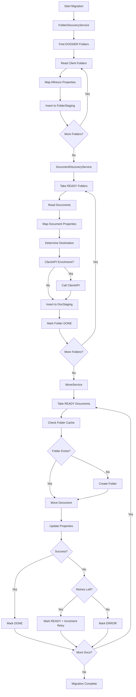

# 📚 Dokumentacija Migracione Aplikacije - Tri Servisa

**Verzija**: 1.0
**Datum**: 2025-11-11
**Status**: Production Ready

---

## 📋 Sadržaj

1. [Pregled Arhitekture](#pregled-arhitekture)
2. [FolderDiscoveryService](#1-folderdiscoveryservice)
3. [DocumentDiscoveryService](#2-documentdiscoveryservice)
4. [MoveService](#3-moveservice)
5. [Flow Dijagram](#flow-dijagram)
6. [Baza Podataka](#baza-podataka)
7. [Checkpoint Sistem](#checkpoint-sistem)
8. [Error Handling](#error-handling)

---

## 🏗️ Pregled Arhitekture

Migraciona aplikacija se sastoji od **tri nezavisna servisa** koji rade sekvencijalno:

```
┌─────────────────────┐
│ FolderDiscovery     │ ← Faza 1: Otkrivanje foldera
└─────────┬───────────┘
          │
          ▼
┌─────────────────────┐
│ DocumentDiscovery   │ ← Faza 2: Otkrivanje dokumenata
└─────────┬───────────┘
          │
          ▼
┌─────────────────────┐
│ MoveService         │ ← Faza 3: Migracija dokumenata
└─────────────────────┘
```

### Ključne Karakteristike

- ✅ **Checkpoint Sistem** - Svaki servis čuva stanje i može nastaviti odakle je stao
- ✅ **Parallel Processing** - DocumentDiscovery i MoveService koriste paralelizam
- ✅ **Retry Logika** - Automatski retry sa exponential backoff
- ✅ **Progress Tracking** - Real-time praćenje napretka
- ✅ **Database-First Approach** - Sve se prvo zapisuje u staging tabele
- ✅ **ClientAPI Integration** - Obogaćivanje podataka sa eksternog API-ja

---

## 1. FolderDiscoveryService

### 📌 Svrha

**Otkriva i katalogizuje sve foldere** iz starog Alfresca u `FolderStaging` tabelu.

### 🎯 Zadaci

1. **Pronalazi DOSSIER foldere** (`DOSSIERS-PI`, `DOSSIERS-LE`, `DOSSIERS-ACC`)
2. **Čita sve client foldere** unutar svakog DOSSIER foldera
3. **Mapira Alfresco propertije** u `FolderStaging` tabelu
4. **Popunjava bazične i BarCLEX propertije** direktno iz Alfresca

### 🔄 Proces Rada

#### **Faza 1: Inicijalizacija**

```csharp
// 1. Pronalaženje DOSSIER subfoldera
var subfolders = await _reader.FindDossierSubfoldersAsync(rootId, folderTypes, ct);
// Rezultat: { "PI": "node-id-1", "LE": "node-id-2", "ACC": "node-id-3" }

// 2. Kreiranje cursora za svaki DOSSIER folder
_multiFolderCursor = new MultiFolderDiscoveryCursor(subfolderMap, batchSize);
```

#### **Faza 2: Batch Processing**

```csharp
// Za svaki batch:
while (hasMoreFolders) {
    // 1. Čita foldere iz trenutnog DOSSIER foldera (npr. DOSSIERS-PI)
    var result = await _reader.ReadBatchAsync(request, ct);
    // Request uključuje: include=properties (važno!)

    // 2. Mapira Entry -> FolderStaging
    var foldersToInsert = result.Items.ToFolderStagingListInsert();
    // ToFolderStagingInsert() mapira SVE propertije iz Properties dictionary

    // 3. Upisuje u bazu
    await _ingestor.IngestAsync(foldersToInsert, ct);

    // 4. Čuva checkpoint
    await SaveCheckpointAsync(ct);
}
```

#### **Faza 3: Mapiranje Propertija**

U `ToFolderStagingInsert()` metodu (`Mapper\MyMapper.cs:26-136`):

```csharp
// Čita direktno iz Entry.Properties dictionary
folderStaging.CoreId = GetStringProperty("ecm:coreId");
folderStaging.MbrJmbg = GetStringProperty("ecm:mbrJmbg") ?? GetStringProperty("ecm:jmbg");
folderStaging.ClientName = GetStringProperty("ecm:clientName");
folderStaging.ClientType = GetStringProperty("ecm:clientType");
folderStaging.Segment = GetStringProperty("ecm:bnkClientType") ?? GetStringProperty("ecm:segment");
folderStaging.Staff = GetStringProperty("ecm:staff");
folderStaging.BarCLEXName = GetStringProperty("ecm:barCLEXName");
folderStaging.BarCLEXOpu = GetStringProperty("ecm:barCLEXOpu") ?? GetStringProperty("ecm:bnkOfficeId");
// ... i svi ostali propertiji
```

### 📊 Output

**Tabela**: `FolderStaging`

**Status Foldera**: `READY` (odmah spremni za DocumentDiscovery)

**Popunjeni Propertiji**:
- ✅ Bazični (NodeId, ParentId, Name, CoreId, ClientName, MbrJmbg)
- ✅ Klijent Info (ClientType, ClientSubtype, Segment, Residency)
- ✅ Dodatni (Staff, OpuUser, OpuRealization, Barclex, Collaborator)
- ✅ BarCLEX (BarCLEXName, BarCLEXOpu, BarCLEXGroupName, BarCLEXGroupCode, BarCLEXCode)
- ✅ Metadata (ProductType, ContractNumber, Batch, Source, TipDosijea, Creator)

### 📈 Metrике

- **BatchSize**: Broj foldera po batch-u (default: 100)
- **MaxEmptyResults**: Nakon koliko praznih batcha se zaustavlja (default: 3)
- **IdleDelayInMs**: Pauza između praznih batcha (default: 5000ms)

### ⚡ Performance

```
Tipičan run:
- 10,000 foldera
- BatchSize: 100
- Vreme: ~2-3 minuta
- Throughput: ~50-80 foldera/sekundu
```

---

## 2. DocumentDiscoveryService

### 📌 Svrha

**Otkriva sve dokumente** unutar foldera iz `FolderStaging` tabele i upisuje ih u `DocStaging` tabelu.

### 🎯 Zadaci

1. **Uzima foldere u statusu READY** iz `FolderStaging`
2. **Čita sve dokumente** za svaki folder iz Alfresca
3. **Mapira document propertije** (tip, status, datum, itd.)
4. **Određuje tip dokumenta** i destination folder (PI/LE/ACC)
5. **Upisuje dokumente** u `DocStaging` sa statusom READY
6. **Obogaćuje foldere sa ClientAPI** (ako su potrebni podaci)

### 🔄 Proces Rada

#### **Faza 1: Acquire Folders**

```csharp
// 1. Atomično preuzimanje foldera (sa zaključavanjem)
var folders = await AcquireFoldersForProcessingAsync(batchSize, ct);
// SQL: UPDATE FolderStaging SET Status='PROCESSING' WHERE Status='READY' ... (WITH ROWLOCK)

// Status: READY → PROCESSING
```

#### **Faza 2: Parallel Processing**

```csharp
// Za svaki folder paralelno (DOP = 4):
await Parallel.ForEachAsync(folders, parallelOptions, async (folder, ct) => {

    // 1. Čita dokumente iz Alfresca
    var documents = await _reader.ReadDocumentsAsync(folder.NodeId, ct);
    // Include: properties, path (za kompletne podatke)

    // 2. Mapira dokumente
    var mappedDocs = new List<DocStaging>();
    foreach (var doc in documents) {
        var docStaging = MapDocumentToStaging(doc, folder);

        // 3. Određuje destination i tip
        var (destinationFolder, targetType) = DetermineDestination(doc, folder);
        docStaging.TargetDossierType = targetType;
        docStaging.ToPath = destinationFolder;

        mappedDocs.Add(docStaging);
    }

    // 4. Upisuje dokumente u bazu
    await _ingestor.IngestBatchAsync(mappedDocs, ct);

    // 5. Označava folder kao DONE
    await _folderRepo.SetStatusAsync(folder.Id, "DONE", null, ct);
});
```

#### **Faza 3: Document Type Resolution**

Koristi `OpisToTipMapperV2` za mapiranje:

```csharp
// Primer 1: Regular document
var docDesc = doc.Properties["ecm:docDesc"];
var mapping = _opisToTipMapper.GetMappingInfo(docDesc);
// Rezultat: { DocumentType: "00003", TargetType: "PI", NeedsTransformation: false }

// Primer 2: Account Package document
if (docDesc == "Account Package") {
    targetType = "ACC"; // Ide u DOSSIERS-ACC folder
}

// Primer 3: Deposit document
if (folder.TipDosijea == "Dosije depozita") {
    targetType = "DE"; // Depozit
}
```

#### **Faza 4: ClientAPI Enrichment** (Opciono)

```csharp
// Ako folder nema propertije, obogaćuje sa ClientAPI
if (!folder.HasClientProperties()) {
    var clientData = await _clientApi.GetClientDataAsync(folder.CoreId, ct);

    // Mapira ClientData u FolderStaging
    folder.ClientName = clientData.ClientName;
    folder.Segment = clientData.Segment;
    folder.BarCLEXOpu = clientData.BarCLEXOpu;
    // ... ostali propertiji

    await _folderRepo.UpdateAsync(folder, ct);
}
```

### 📊 Output

**Tabela**: `DocStaging`

**Status Dokumenata**: `READY` (spremni za Move)

**Popunjeni Propertiji**:
- ✅ Bazični (NodeId, Name, ParentId, IsFile, IsFolder)
- ✅ Paths (FromPath, ToPath)
- ✅ Document Info (DocumentType, CategoryCode, CoreId, ContractNumber)
- ✅ Migration Info (RequiresTypeTransformation, FinalDocumentType, TargetDossierType)
- ✅ Metadata (OriginalCreatedAt, Source, Version, IsSigned)

### 📈 Metrike

- **BatchSize**: Broj foldera po batch-u (default: 50)
- **MaxDegreeOfParallelism**: Broj paralelnih foldera (default: 4)
- **IdleDelayInMs**: Pauza između batch-eva (default: 5000ms)

### ⚡ Performance

```
Tipičan run:
- 10,000 foldera sa 3 dokumenta svaki = 30,000 dokumenata
- BatchSize: 50, DOP: 4
- Vreme: ~10-15 minuta
- Throughput: ~30-50 dokumenata/sekundu
```

---

## 3. MoveService

### 📌 Svrha

**Premešta dokumente** iz starog Alfresca u novi Alfresco sa pravilnom strukturom foldera.

### 🎯 Zadaci

1. **Uzima dokumente u statusu READY** iz `DocStaging`
2. **Kreira folder strukturu** (DOSSIERS-PI/PI123/subfolder)
3. **Premešta dokumente** iz starog u novi Alfresco
4. **Ažurira propertije** na novim dokumentima
5. **Označava dokumente kao DONE** ili ERROR

### 🔄 Proces Rada

#### **Faza 1: Acquire Documents**

```csharp
// 1. Atomično preuzimanje dokumenata
var documents = await AcquireDocumentsForMoveAsync(batchSize, ct);
// SQL: UPDATE DocStaging SET Status='PROCESSING' WHERE Status='READY' ... (WITH ROWLOCK)

// Status: READY → PROCESSING
```

#### **Faza 2: Parallel Move**

```csharp
// Za svaki dokument paralelno (DOP = 8):
await Parallel.ForEachAsync(documents, parallelOptions, async (doc, ct) => {

    // 1. Resolve folder strukture
    var (targetFolderId, created) = await GetOrCreateTargetFolderAsync(doc, ct);
    // Kreira: DOSSIERS-PI → PI102206 → subfolder (ako treba)

    // 2. Move dokument
    var success = await _write.MoveDocumentAsync(
        doc.NodeId,         // NodeId u starom Alfrescom
        targetFolderId,     // Destination folder u novom Alfrescom
        doc.Name,           // Novi naziv
        ct
    );

    // 3. Update propertija (ako treba)
    if (doc.RequiresTypeTransformation) {
        var properties = BuildDocumentProperties(doc);
        await _write.UpdateNodePropertiesAsync(doc.NodeId, properties, ct);
    }

    // 4. Označava kao DONE
    await _docRepo.SetStatusAsync(doc.Id, "DONE", null, ct);
});
```

#### **Faza 3: Folder Creation with Cache**

```csharp
// Cache key: "TargetDossierType_DossierDestFolderId"
// Primer: "500_PI102206" → "abc-def-123-456" (Alfresco NodeId)

var cacheKey = $"{doc.TargetDossierType}_{doc.DossierDestFolderId}";

// Check cache prvo
if (_folderCache.TryGetValue(cacheKey, out var cachedFolderId)) {
    return cachedFolderId; // Folder već postoji
}

// Synchronizacija po cache key-u (izbegava duplicate folder creation)
var lockObj = _folderLocks.GetOrAdd(cacheKey, _ => new SemaphoreSlim(1, 1));
await lockObj.WaitAsync(ct);

try {
    // Double-check after acquiring lock
    if (_folderCache.TryGetValue(cacheKey, out cachedFolderId)) {
        return cachedFolderId;
    }

    // Kreiranje folder strukture
    var dossierFolderId = await GetDossierFolderAsync(doc.TargetDossierType, ct);
    // DOSSIERS-PI/LE/ACC

    var clientFolderId = await _write.CreateFolderAsync(
        dossierFolderId,
        doc.DossierDestFolderId, // PI102206
        ct
    );

    // Cache result
    _folderCache[cacheKey] = clientFolderId;
    return clientFolderId;
}
finally {
    lockObj.Release();
}
```

#### **Faza 4: Error Handling**

```csharp
// Ako move failed:
try {
    await MoveDocumentAsync(doc, ct);
}
catch (Exception ex) {
    // Increment retry count
    var retryCount = doc.RetryCount + 1;

    if (retryCount >= MaxRetries) {
        // Permanently failed
        await _docRepo.SetStatusAsync(doc.Id, "ERROR", ex.Message, ct);
    }
    else {
        // Retry later
        await _docRepo.IncrementRetryAsync(doc.Id, ex.Message, ct);
        await _docRepo.SetStatusAsync(doc.Id, "READY", ex.Message, ct);
    }
}
```

### 📊 Output

**Tabela**: `DocStaging`

**Status Dokumenata**: `DONE` ili `ERROR`

**Folder Struktura u Novom Alfrescom**:

```
Root
├── DOSSIERS-PI
│   ├── PI102206
│   │   ├── Document1.pdf
│   │   └── Document2.pdf
│   └── PI102207
│       └── Document3.pdf
├── DOSSIERS-LE
│   └── LE500123
│       └── Document4.pdf
└── DOSSIERS-ACC
    └── ACC13001926
        └── AccountPackage.pdf
```

### 📈 Metrike

- **BatchSize**: Broj dokumenata po batch-u (default: 100)
- **MaxDegreeOfParallelism**: Broj paralelnih move operacija (default: 8)
- **MaxRetries**: Maksimalan broj pokušaja (default: 3)
- **IdleDelayInMs**: Pauza između batch-eva (default: 5000ms)

### ⚡ Performance

```
Tipičan run:
- 30,000 dokumenata
- BatchSize: 100, DOP: 8
- Vreme: ~20-30 minuta
- Throughput: ~15-25 dokumenata/sekundu
```

---

## 🔄 Flow Dijagram

### Kompletan Migracija Flow



### Status Transitions

```
FolderStaging:
  NEW → READY → PROCESSING → DONE
                           ↘ ERROR

DocStaging:
  NEW → READY → PROCESSING → DONE
              ↗ RETRY       ↘ ERROR
```

---

## 🗄️ Baza Podataka

### FolderStaging Tabela

**Kolone**: 41

**Ključna Polja**:

| Kolona | Tip | Opis |
|--------|-----|------|
| `Id` | BIGINT | Auto-increment primary key |
| `NodeId` | NVARCHAR(255) | Alfresco node ID |
| `ParentId` | NVARCHAR(255) | Parent folder ID |
| `Name` | NVARCHAR(500) | Folder name (PI-102206) |
| `Status` | NVARCHAR(50) | NEW/READY/PROCESSING/DONE/ERROR |
| `CoreId` | NVARCHAR(50) | Client CoreId |
| `ClientName` | NVARCHAR(500) | Client name |
| `DestFolderId` | NVARCHAR(255) | Destination folder ID (popunjava se kasnije) |
| `DossierDestFolderId` | NVARCHAR(255) | Destination DOSSIER folder ID |
| `TargetDossierType` | NVARCHAR(50) | Target type (PI/LE/ACC) |
| `ClientSegment` | NVARCHAR(100) | Client segment |
| `BarCLEXName` | NVARCHAR(255) | BarCLEX Name (novi property) |
| `BarCLEXOpu` | NVARCHAR(100) | BarCLEX OPU (novi property) |
| `BarCLEXGroupName` | NVARCHAR(255) | BarCLEX Group Name (novi property) |
| `BarCLEXGroupCode` | NVARCHAR(100) | BarCLEX Group Code (novi property) |
| `BarCLEXCode` | NVARCHAR(100) | BarCLEX Code (novi property) |

### DocStaging Tabela

**Kolone**: 30+

**Ključna Polja**:

| Kolona | Tip | Opis |
|--------|-----|------|
| `Id` | BIGINT | Auto-increment primary key |
| `NodeId` | NVARCHAR(255) | Alfresco node ID |
| `Name` | NVARCHAR(500) | Document name |
| `Status` | NVARCHAR(50) | NEW/READY/PROCESSING/DONE/ERROR |
| `FromPath` | NVARCHAR(2000) | Source path in old Alfresco |
| `ToPath` | NVARCHAR(2000) | Destination path in new Alfresco |
| `DocumentType` | NVARCHAR(50) | Document type code (00003) |
| `CoreId` | NVARCHAR(50) | Client CoreId |
| `RequiresTypeTransformation` | BIT | Needs type transformation? |
| `FinalDocumentType` | NVARCHAR(50) | Final document type after transformation |
| `TargetDossierType` | NVARCHAR(50) | Target dossier type (PI/LE/ACC/DE) |
| `RetryCount` | INT | Number of retry attempts |
| `ErrorMsg` | NVARCHAR(MAX) | Error message if failed |

### MigrationCheckpoint Tabela

**Ključna Polja**:

| Kolona | Tip | Opis |
|--------|-----|------|
| `Id` | BIGINT | Auto-increment primary key |
| `ServiceName` | NVARCHAR(100) | Service name (FolderDiscovery/DocumentDiscovery/Move) |
| `CheckpointData` | NVARCHAR(MAX) | JSON serialized checkpoint |
| `LastProcessedId` | NVARCHAR(255) | Last processed item ID |
| `TotalProcessed` | BIGINT | Total items processed |
| `TotalFailed` | BIGINT | Total items failed |
| `UpdatedAt` | DATETIME2 | Last update timestamp |

---

## 🔖 Checkpoint Sistem

### Svrha

**Omogućava resume** migracione operacije nakon restarta ili greške.

### Format

```json
{
  "LastObjectId": "abc-def-123-456",
  "LastObjectCreated": "2025-11-11T10:30:00Z",
  "SubfolderMap": {
    "PI": "node-id-1",
    "LE": "node-id-2",
    "ACC": "node-id-3"
  },
  "CurrentType": "PI",
  "CurrentCursor": {
    "LastObjectId": "xyz-789",
    "LastObjectCreated": "2025-11-11T10:35:00Z"
  },
  "BatchSize": 100
}
```

### Kako Radi

```csharp
// Save Checkpoint
var checkpointData = new {
    LastObjectId = cursor.LastObjectId,
    LastObjectCreated = cursor.LastCreatedAt,
    SubfolderMap = _multiFolderCursor.SubfolderMap,
    CurrentType = _multiFolderCursor.CurrentType,
    BatchSize = _multiFolderCursor.BatchSize
};

var json = JsonSerializer.Serialize(checkpointData);
await _checkpointRepo.SaveAsync(ServiceName, json, ct);

// Load Checkpoint
var checkpoint = await _checkpointRepo.LoadAsync(ServiceName, ct);
if (checkpoint != null) {
    var data = JsonSerializer.Deserialize<CheckpointData>(checkpoint.Data);
    _multiFolderCursor = RestoreCursor(data);
}
```

### Frequency

- **FolderDiscoveryService**: Nakon svakog batch-a
- **DocumentDiscoveryService**: Nakon svakog batch-a
- **MoveService**: Nakon svakog batch-a

---

## ⚠️ Error Handling

### Strategija

1. **Retry sa Exponential Backoff** - 3 pokušaja sa povećavanjem delay-a
2. **Status Tracking** - Svaki dokument/folder prati svoj status
3. **Error Logging** - Detaljno logovanje u bazu i fajl
4. **Graceful Degradation** - Nastavlja sa sledećim batch-om ako jedan failed

### Error Types

| Error Type | Handling | Status |
|------------|----------|--------|
| **Network Timeout** | Retry 3x | READY (za retry) |
| **Alfresco API Error** | Retry 3x | READY (za retry) |
| **Node Not Found** | Log + Skip | ERROR |
| **Permission Denied** | Log + Skip | ERROR |
| **Database Error** | Fail batch + Retry batch | - |
| **ClientAPI Timeout** | Continue without enrichment | DONE |

### Retry Logic

```csharp
for (int attempt = 0; attempt <= MaxRetries; attempt++) {
    try {
        await ProcessAsync(item, ct);
        break; // Success
    }
    catch (Exception ex) when (attempt < MaxRetries) {
        var delay = TimeSpan.FromMilliseconds(
            RetryBaseDelayMs * Math.Pow(2, attempt)
        );
        await Task.Delay(delay, ct);
    }
    catch (Exception ex) {
        // Final failure
        await MarkAsErrorAsync(item, ex.Message, ct);
    }
}
```

---

## 📊 Monitoring & Metrics

### Loggers

1. **FileLogger** - Detaljni log u fajl (`logs/migration-{date}.log`)
2. **DbLogger** - Kritični eventi u bazu (`AlfrescoMigration_Logger`)
3. **UiLogger** - Progress updates za UI

### Key Metrics

```csharp
// FolderDiscoveryService
- TotalInserted: Ukupan broj otkrivenih foldera
- CurrentDossierType: Trenutni DOSSIER folder (PI/LE/ACC)
- Progress: % completion

// DocumentDiscoveryService
- TotalProcessed: Ukupan broj obrađenih foldera
- TotalDocuments: Ukupan broj otkrivenih dokumenata
- TotalFailed: Broj faileda
- Progress: % completion

// MoveService
- TotalMoved: Ukupan broj premještenih dokumenata
- TotalFailed: Broj faileda
- FolderCacheSize: Broj cached foldera
- Progress: % completion
```

### Progress Callback

```csharp
progressCallback?.Invoke(new WorkerProgress
{
    ServiceName = "FolderDiscovery",
    TotalProcessed = _totalInserted,
    TotalFailed = 0,
    CurrentBatch = batchCounter,
    EstimatedRemaining = totalCount - _totalInserted,
    ProgressPercentage = (_totalInserted * 100.0) / totalCount
});
```

---

## 🚀 Best Practices

### Performance Tuning

1. **Batch Size**
   - FolderDiscovery: 100-200 (manji overhead)
   - DocumentDiscovery: 50-100 (više processing)
   - MoveService: 100-200 (network-bound)

2. **Degree of Parallelism**
   - DocumentDiscovery: 4-8 (CPU-bound)
   - MoveService: 8-16 (network-bound)

3. **Delays**
   - IdleDelayInMs: 5000ms (avoid thrashing)
   - DelayBetweenBatchesInMs: 1000ms (give Alfresco breathing room)

### Monitoring

1. **Check Logs Redovno**
   - `logs/migration-{date}.log`
   - Database: `AlfrescoMigration_Logger`

2. **Monitor Status Distribution**
   ```sql
   SELECT Status, COUNT(*) FROM FolderStaging GROUP BY Status;
   SELECT Status, COUNT(*) FROM DocStaging GROUP BY Status;
   ```

3. **Track ERROR Items**
   ```sql
   SELECT * FROM DocStaging WHERE Status = 'ERROR' ORDER BY UpdatedAt DESC;
   ```

### Troubleshooting

**Problem**: Servis stoji na PROCESSING statusu
**Solution**: Resetuj status na READY

```sql
UPDATE FolderStaging SET Status = 'READY' WHERE Status = 'PROCESSING';
UPDATE DocStaging SET Status = 'READY' WHERE Status = 'PROCESSING';
```

**Problem**: Previše ERROR-a
**Solution**: Proveri Alfresco connectivity, permissions, node existence

**Problem**: ClientAPI Timeout
**Solution**: Povećaj timeout ili nastavi bez ClientAPI podataka

---

## 📝 Changelog

### v1.0 (2025-11-11)
- ✅ Initial documentation
- ✅ Documented all 3 services
- ✅ Added BarCLEX properties support
- ✅ Added ClientAPI integration
- ✅ Added folder property mapping from Alfresco

---

## 📞 Support

Za pitanja i bug reports:
- GitHub Issues: [link]
- Email: [email]

---

**EOF** 🎉
